# Audio-AI-Transformer-Comparison

Bu proje, ses verisi üzerinde dört farklı transformator modelinin (Hubert, Wav2vec, WavLM, Data2Vec) performansını karşılaştırmayı amaçlamaktadır. Modellerin performansı, Accuracy, Recall, Precision, Sensitivity, Specificity, F-Score ve AUC gibi metrikler kullanılarak değerlendirilmiştir. Ayrıca, ses sinyallerinin frekans ve zaman domain'lerindeki özelliklerini görselleştirmek için spektrogram ve waveplot grafikleri kullanılmıştır.

## Proje Hakkında

Bu proje, Kocaeli Üniversitesi, Teknoloji Fakültesi, Bilişim Sistemleri Mühendisliği bölümünde yürütülmüştür. Proje, ses verisi üzerinde yapay zeka modellerinin performansını analiz etmek ve en etkili modeli belirlemek amacıyla gerçekleştirilmiştir.

## Kullanılan Modeller

- **Hubert**: Maskeli öğrenme yöntemiyle ses temsilleri öğrenen bir modeldir.
- **Wav2vec**: Ses verilerinden özellik çıkarımı yaparak etkili sonuçlar elde eder.
- **WavLM**: Büyük ölçekli ses verileri üzerinde eğitilmiş bir modeldir.
- **Data2Vec**: Ses, metin ve görüntü gibi farklı veri tipleri için genel bir öğrenme çerçevesi sunar.

## Performans Metrikleri

Modellerin performansı aşağıdaki metrikler kullanılarak değerlendirilmiştir:

- **Accuracy**: Doğru sınıflandırılan örneklerin toplam örnek sayısına oranı.
- **Recall**: Gerçek pozitiflerin, gerçek pozitifler ve yanlış negatifler toplamına oranı.
- **Precision**: Gerçek pozitiflerin, gerçek pozitifler ve yanlış pozitifler toplamına oranı.
- **Sensitivity**: Recall ile aynı anlama gelir.
- **F-Score**: Precision ve Recall metriklerinin harmonik ortalaması.
- **AUC (Area Under Curve)**: ROC eğrisi altında kalan alan.

## Sonuçlar

### Model Performansları

| Model    | Accuracy | Recall | Precision | F-Score | AUC  |
|----------|----------|--------|-----------|---------|------|
| Hubert   | 0.27     | 0.27   | 0.07      | 0.12    | 0.56 |
| Wav2vec  | 0.27     | 0.27   | 0.07      | 0.12    | 0.47 |
| WavLM    | 0.36     | 0.36   | 0.20      | 0.24    | 0.64 |
| Data2Vec | 0.25     | 0.25   | 0.06      | 0.10    | 0.50 |

### Eğitim ve Çıkarım Süreleri

| Model    | Eğitim Süresi (s) | Çıkarım Süresi (s) |
|----------|------------------|-------------------|
| Hubert   | 4903             | 383               |
| Wav2vec  | 947              | 186               |
| WavLM    | 20295            | 1504              |
| Data2Vec | 7577             | 1184              |

### Görselleştirmeler

Ses sinyallerinin frekans ve zaman domain'lerindeki özelliklerini görselleştirmek için spektrogram ve waveplot grafikleri kullanılmıştır. Aşağıda, mutlu, üzgün, öfkeli ve nötr duygulara ait örnek grafikler gösterilmektedir.

#### Mutlu Duygu
- **Waveplot Grafiği**  
  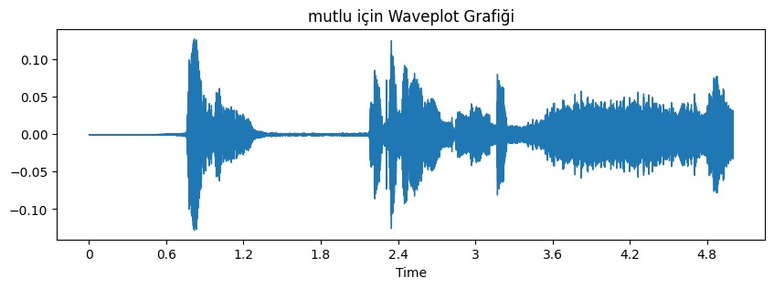
- **Spektrogram Grafiği**  
  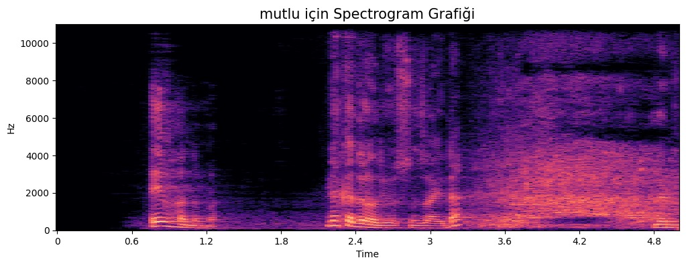

#### Üzgün Duygu
- **Waveplot Grafiği**  
  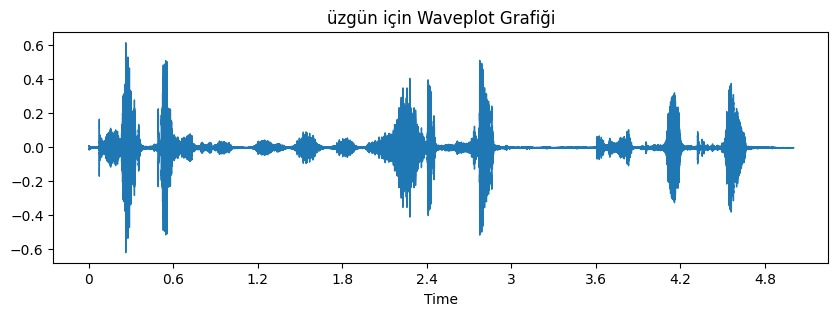
- **Spektrogram Grafiği**  
  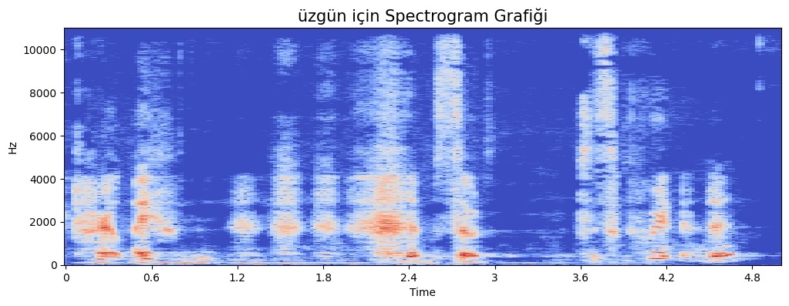

#### Öfkeli Duygu
- **Waveplot Grafiği**  
  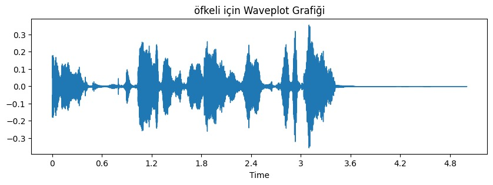
- **Spektrogram Grafiği**  
  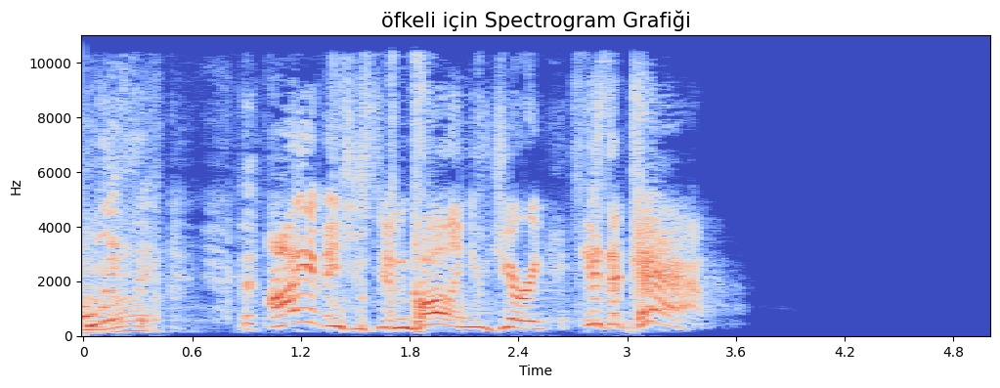

#### Nötr Duygu
- **Waveplot Grafiği**  
  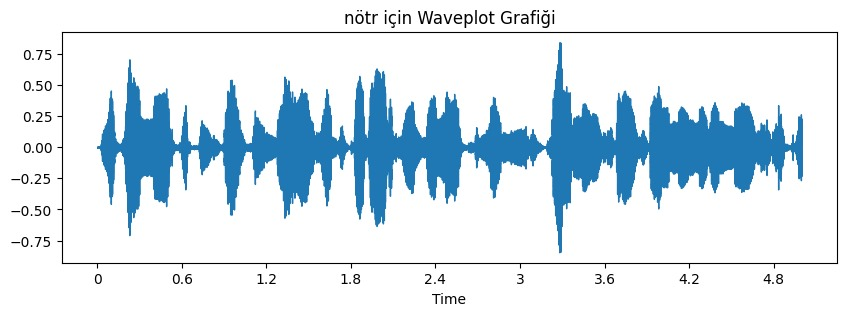
- **Spektrogram Grafiği**  
  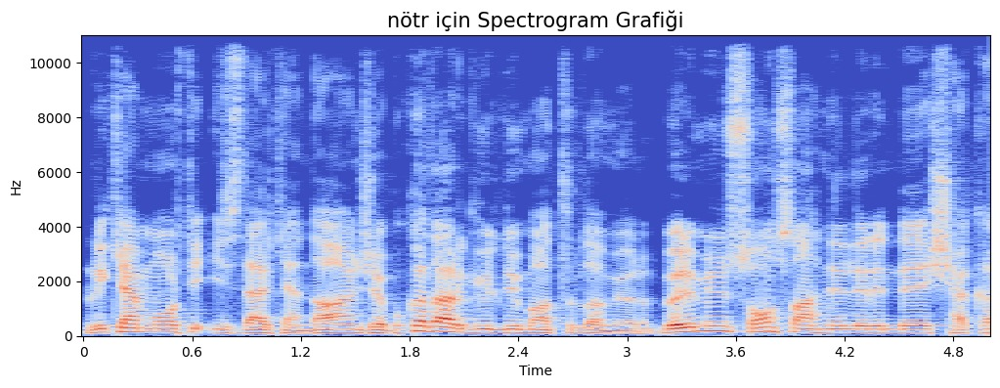

### Diğer Görselleştirmeler

- **ROC Eğrisi**  
  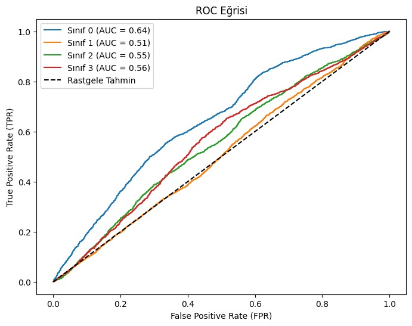

- **Karmaşıklık Matrisi**  
  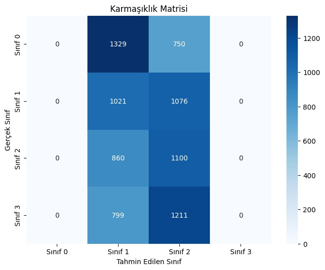

- **Epoch Sayısı vs Loss Grafiği**  
  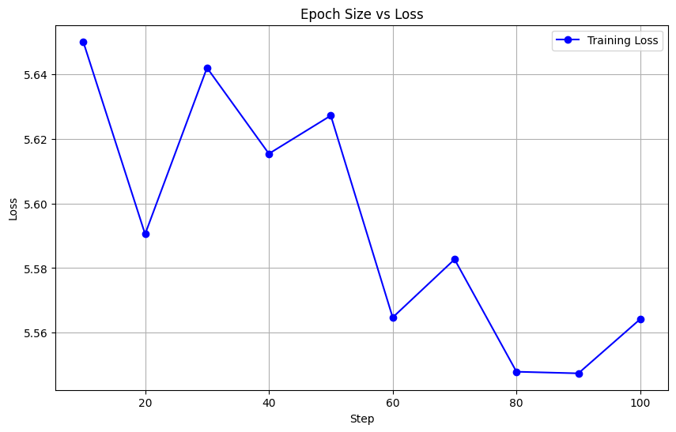
